# Architecture, phase by phase

Each diagram shows the whole DevOps and GitOps architecture of this system as implemented after one phase of the demo-environment skill. Elements with a green border were added in that phase; dashed elements are names already trusted (a federated subject, an OIDC identity) but not created yet.

The `.puml` files are the sources (C4-PlantUML); the `.png` files are rendered from them by `write-architecture-diagrams.ps1` in the demo-environment kit.

## Phase 0: operator identity (2026-10-04)

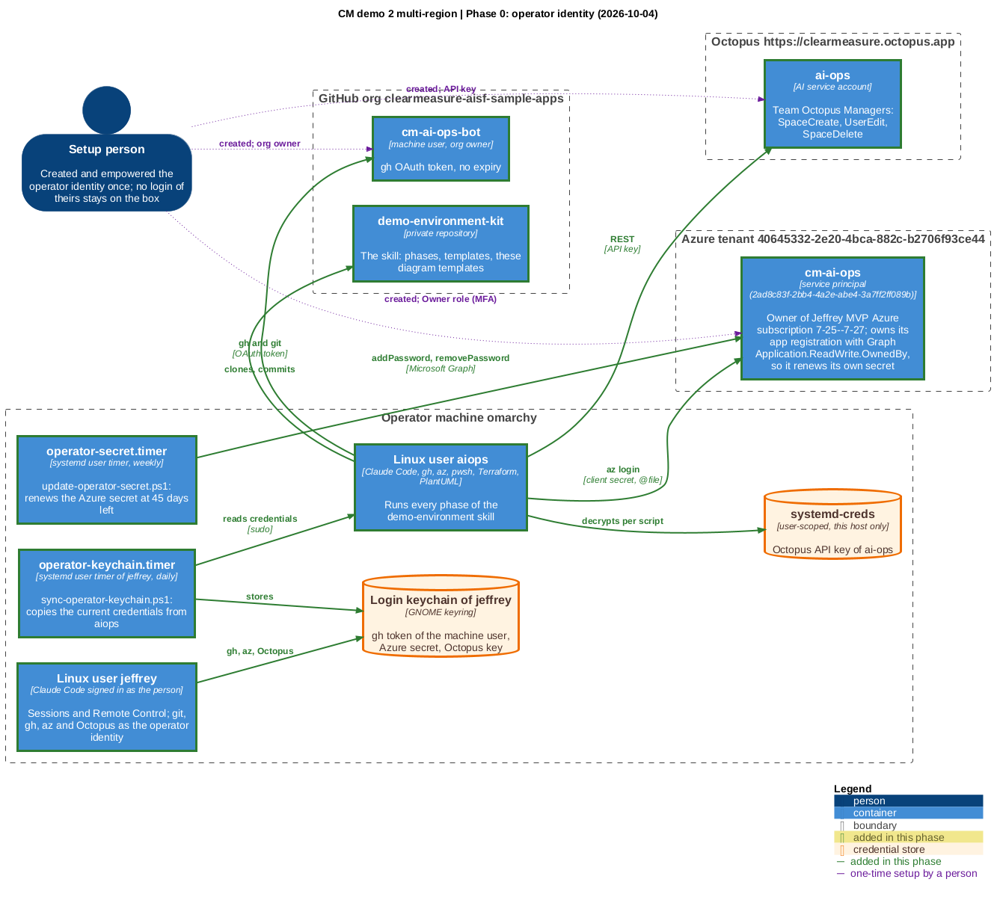

Source: [00-operator-identity.puml](00-operator-identity.puml)

## Phase 1: Octopus foothold (2026-10-04)

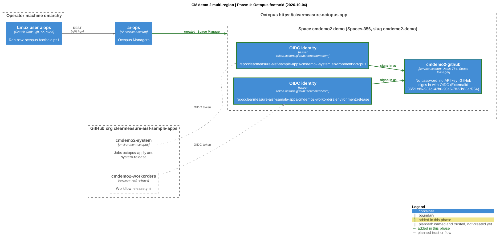

Source: [01-octopus-foothold.puml](01-octopus-foothold.puml)

## Phase 2: Azure seed (2026-10-05)

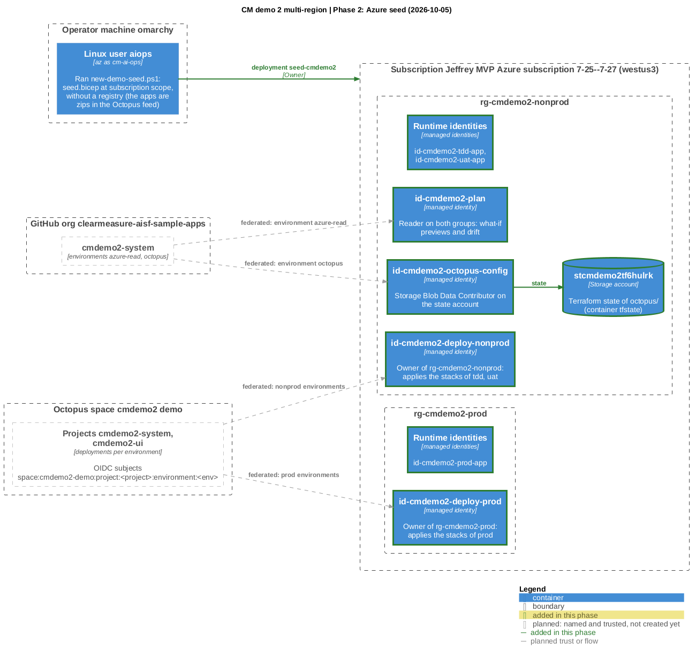

Source: [02-azure-seed.puml](02-azure-seed.puml)

## Phase 3: system repository pushed (2026-10-04)

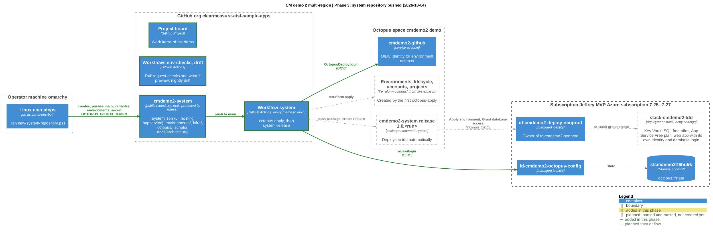

Source: [03-system-repository.puml](03-system-repository.puml)

## Phase 3a: tdd environment from the pipeline (2026-10-04)

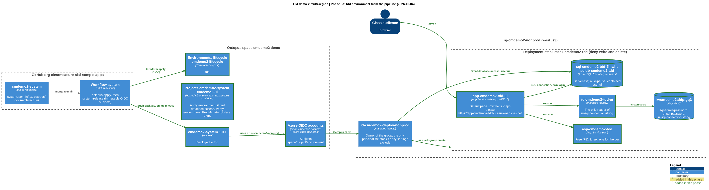

Source: [03a-tdd-environment.puml](03a-tdd-environment.puml)

## Phase 4: app repository pushed (2026-10-04)

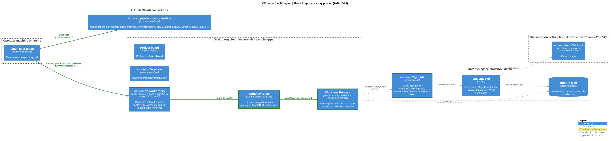

Source: [04-app-repository.puml](04-app-repository.puml)

## Phase 4a: app 2.4.6 running in tdd (2026-10-04)

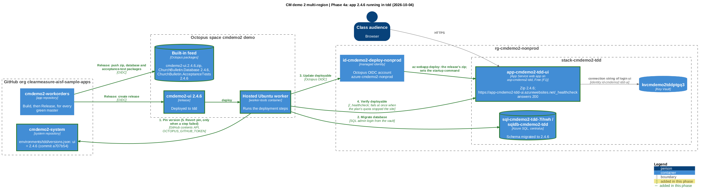

Source: [04a-app-in-tdd.puml](04a-app-in-tdd.puml)

## Progression: uat added and promoted (2026-10-05)

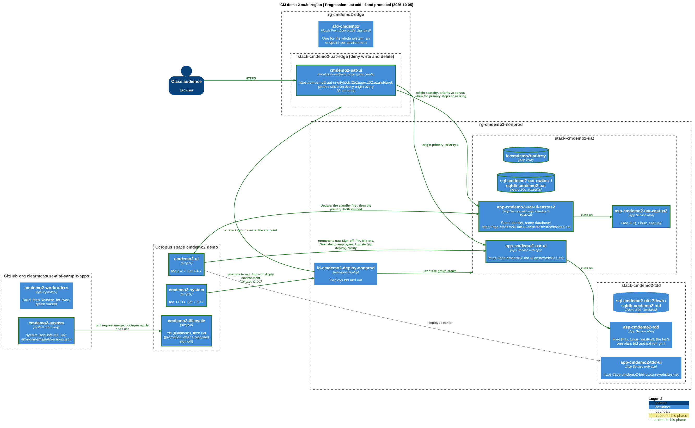

Source: [05-uat-environment.puml](05-uat-environment.puml)

## Progression: prod added and promoted (2026-10-05)

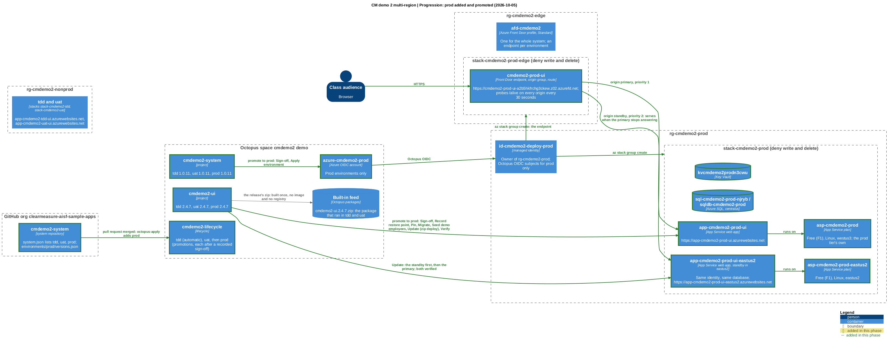

Source: [06-prod-environment.puml](06-prod-environment.puml)

## Public address: Front Door in front of tdd (2026-10-04)

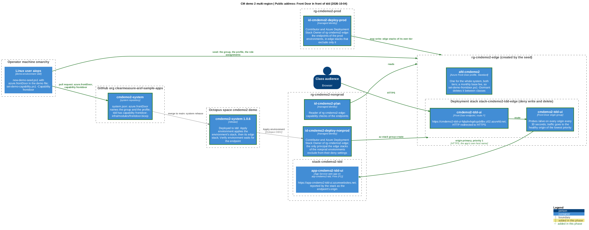

Source: [12-public-address.puml](12-public-address.puml)

## A dashboard of every node (2026-10-04)

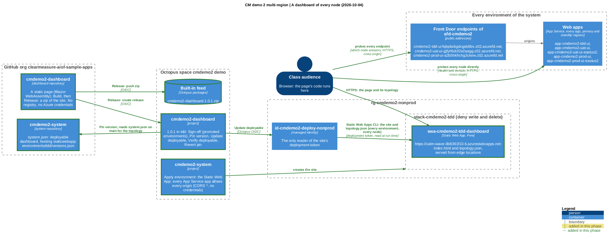

Source: [13-dashboard.puml](13-dashboard.puml)

## What depends on what: the system, its GitOps repositories and its DevOps pipeline (2026-10-06)

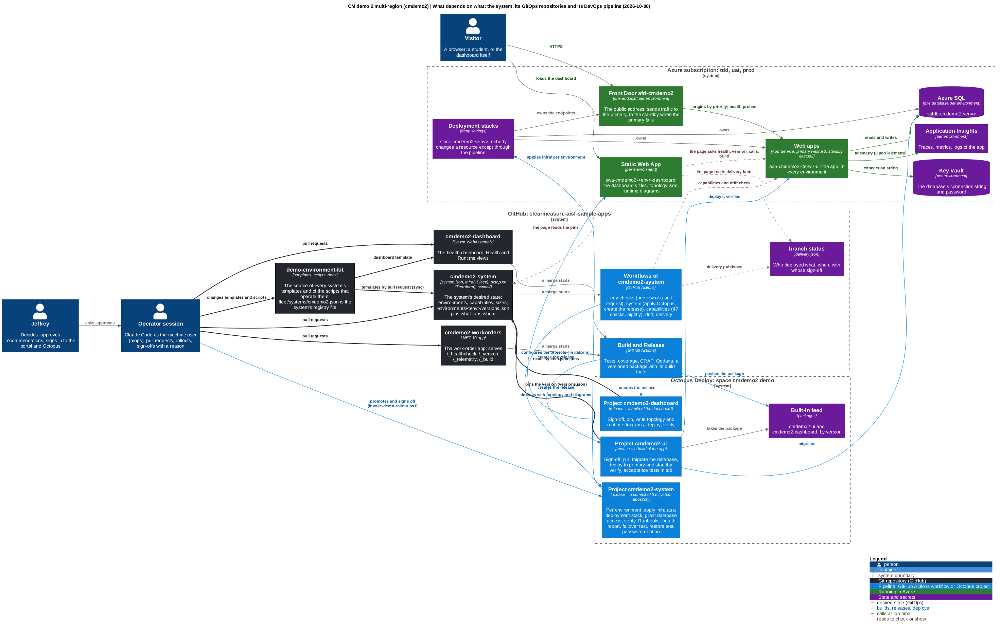

Source: [20-dependencies.puml](20-dependencies.puml)
